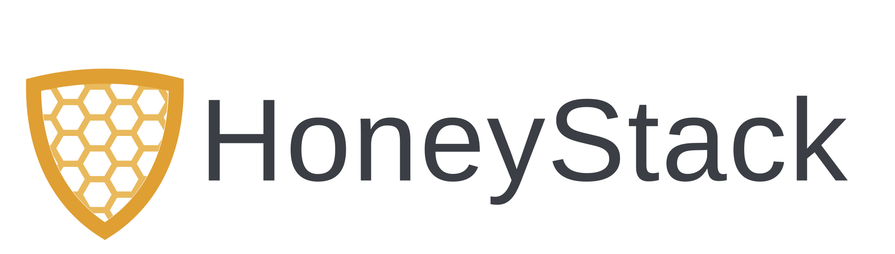
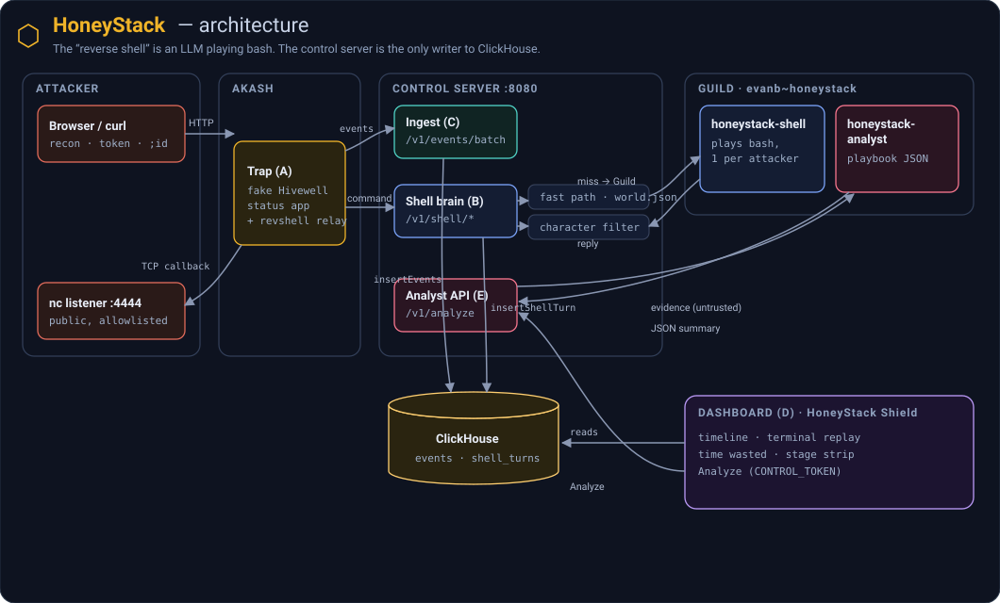

<p align="center">
  <picture>
    <source media="(prefers-color-scheme: dark)" srcset="assets/honeystack-logo-dark.svg">
    
  </picture>
</p>

<p align="center"><b>The honeypot where the hacker breaks into a server that was never real.</b></p>

<p align="center">
An attacker exploits a fake company site, pops a “reverse shell,” and ransacks a machine that is actually an <b>LLM playing bash</b> — while every keystroke is recorded and turned into an attacker playbook.<br>
Built on <b>Akash</b>, <b>ClickHouse</b>, and <b>Guild AI</b>.
</p>

---

## See it in action

**Watch someone "hack" a company live — then the reveal that none of it was real.**

Classic honeypots are static: a real attacker (or an autonomous AI agent) fingerprints the canned responses in seconds and leaves, and you learn nothing. HoneyStack makes the "reverse shell" a **live LLM playing bash** — it never breaks character, keeps a consistent fake filesystem, feeds tempting dead-ends, and **wastes the attacker's time** while recording everything. A second agent turns the session into an analyst report — classification, kill-chain, credentials targeted — with every claim linked to the command that proves it.

The target is **Hivewell**, a fake Vermont smart-beehive startup. The demo (~5 min attack, 1 min reveal):

1. **Recon** — `robots.txt` and a careers post point at the internal `/status` board.
2. **Token leak** — the page source ships a hard-coded admin token; `/api/env` dumps fake DB creds.
3. **Injection** — `{"host":"8.8.8.8; id"}` returns `uid=1000(node)` — "RCE confirmed."
4. **Reverse shell** — the payload opens a **real TCP connection** to the attacker's own `nc` listener. Nothing about netcat reveals the bytes are AI-generated.
5. **Post-exploitation** — `cat .env.production`, `psql` (hangs), `~/.aws/credentials` ("jackpot") — all invented, all consistent.
6. **Reveal** — flip to the **HoneyStack Shield** dashboard: live timeline, a "time wasted" counter, and the analyst's kill-chain, each step linked to its evidence.

> *"Every byte they saw was invented. We know who they are and what they were after — and they burned twelve minutes on a machine that doesn't exist."*

▶ **Full run-sheet:** [`docs/demo-script-2m40.md`](docs/demo-script-2m40.md)

## How it works



The attacker exploits the fake Hivewell app on **Akash** and gets a "reverse shell" that is really a **Guild** agent playing bash. The **control server** answers each command (fast path from `world.json`, else Guild) and is the only writer to **ClickHouse**; a second Guild agent turns a session into the playbook shown on the dashboard.

Full detail and sequence diagrams: [`docs/architecture.md`](docs/architecture.md).

## Run it locally

See the **HoneyStack Shield** dashboard against the bundled demo session — no database or cloud needed:

```sh
npm install
npm run build:css:dashboard
CONTROL_TOKEN=secret npm run dev:control        # control server on :8080
```

Open **http://127.0.0.1:8080/admin/plugins/honeystack** and log in with that `CONTROL_TOKEN`. In this mode the dashboard reads the bundled fixture session (`tests/fixtures/demo-session.jsonl`); point it at a real ClickHouse by filling `.env` from [`.env.example`](.env.example). To drive live traffic, run the trap (`npm run dev:trap`) and replay an attack.

## Docs

| | |
|---|---|
| Demo run-sheet (2:40) | [`docs/demo-script-2m40.md`](docs/demo-script-2m40.md) |
| Full architecture + sequence diagrams | [`docs/architecture.md`](docs/architecture.md) |
| The attack scenario, in depth | [`docs/llm-shell-demo.md`](docs/llm-shell-demo.md) |
| Deploying the trap on Akash | [`docs/deploy.md`](docs/deploy.md) · [`deploy/AKASH_PLAN.md`](deploy/AKASH_PLAN.md) |
| Interfaces between components | [`docs/contracts.md`](docs/contracts.md) |

## Contributing

HoneyStack is built in six parallel workstreams (trap, shell brain, data, dashboard, Guild agent, deploy).

- **Pick a workstream:** [`docs/work-split.md`](docs/work-split.md)
- **Using a coding agent?** Tell it your workstream — it reads [`AGENTS.md`](AGENTS.md).

## Akash deployment (Workstream F)

> Also available as a standalone page: [`docs/deploy.md`](docs/deploy.md).

The trap is built and deployed by **CI/CD** (GitHub Actions, `.github/workflows/cd.yml`)
on every push to `main`. The table below is **updated automatically** by that pipeline
after each deploy — do not edit between the markers.

<!-- AKASH-DEPLOY:START -->
| Field | Value |
|---|---|
| Live trap URL | http://clv9e39sgped55dcsdjt5l8q8s.ingress.h6i-dedicated.eu-se-1.digitalfrontier.so/ |
| DSEQ | `1791592438868` |
| Image | `ghcr.io/adityasugandhi/honeystack-trap:latest` |
| Control (dashboard) | http://lqt92l94vlccf0q098f7dfl23k.ingress.h6i-dedicated.eu-se-1.digitalfrontier.so/admin/plugins/honeystack |
| Updated | 2026-10-10 00:39 UTC (auto, CI) |

<!-- AKASH-DEPLOY:END -->

### Deploy / redeploy

```sh
# build + push the amd64 image (needs: docker login ghcr.io), then pin its digest in deploy/akash.yaml
REGISTRY=ghcr.io/adityasugandhi sh scripts/build-trap.sh
docker buildx imagetools inspect ghcr.io/adityasugandhi/honeystack-trap:demo-1

# deploy the trap SDL (akash_key must be in .env)
sh scripts/deploy-trap.sh
sh scripts/close-deployment.sh <DSEQ>        # cleanup
```

**Gotchas we hit** (so nobody loses an hour to them again):
- The image **must be `linux/amd64`** — `build-trap.sh` cross-builds with buildx (Macs are arm64).
- The GHCR package **must be public** (Akash providers pull anonymously), or add a `credentials:` block to the SDL.
- Some providers accept the lease and run the container but their **HTTP ingress returns an nginx `404`** (froggy-servers did this). The container is fine — redeploy excluding that provider:
  ```sh
  SKIP_PROVIDERS=<bad-provider-address> sh scripts/deploy-trap.sh
  ```
