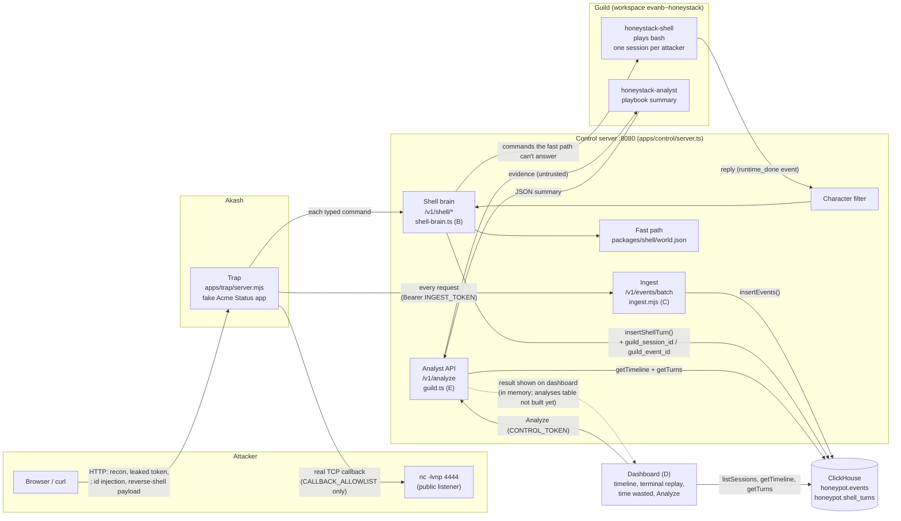
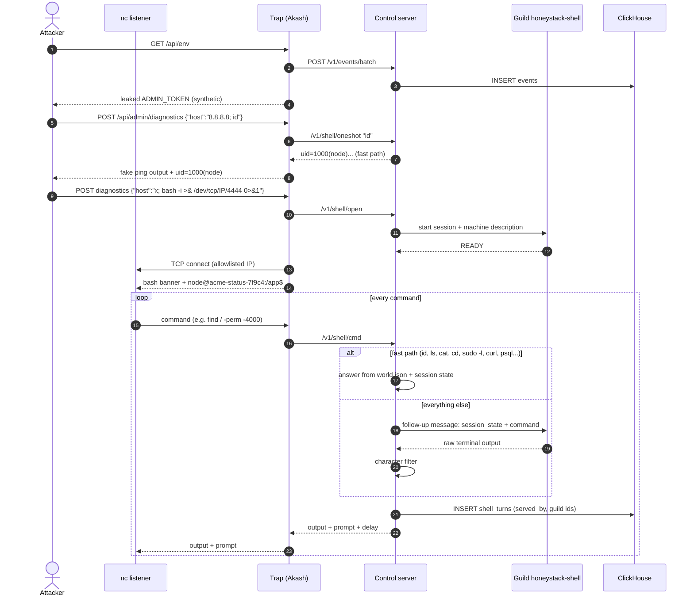
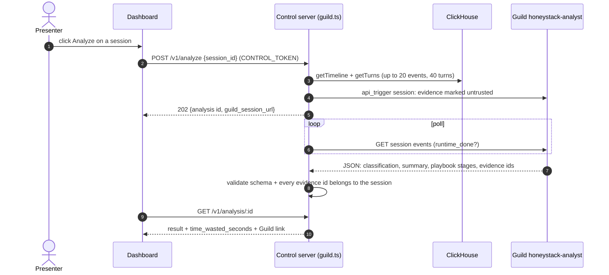
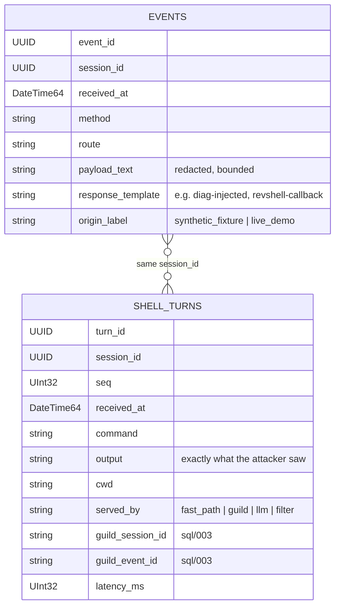

# HoneyStack architecture

The attacker exploits a fake app on Akash and gets a "reverse shell". Every command they type is answered by the control server: common commands from a fixed fake host (`world.json`), everything else by a Guild agent playing bash. The control server is the only thing that writes to ClickHouse. A second Guild agent turns a session into a playbook summary for the dashboard.

## 1. System overview

## 2. One attack, start to finish

## 3. Analysis (the reveal)

## 4. What ClickHouse stores

**Notes**
- Guild never touches ClickHouse; the control server is the only writer. Guild's own transcript and token usage stay in Guild, linked by `guild_session_id`.
- Without `CLICKHOUSE_URL`, the control server runs in dev mode and writes `data/events.jsonl` and `data/shell_turns.jsonl` instead.
- `SHELL_BACKEND=anthropic` replaces the Guild shell agent with direct Claude API calls (same filter, same rows, `served_by: llm`).
- Analyst results are in memory only until an `analyses` table is added (`docs/clickhouse-plan.md` §2.5, hook: `setAnalysisSink`).
